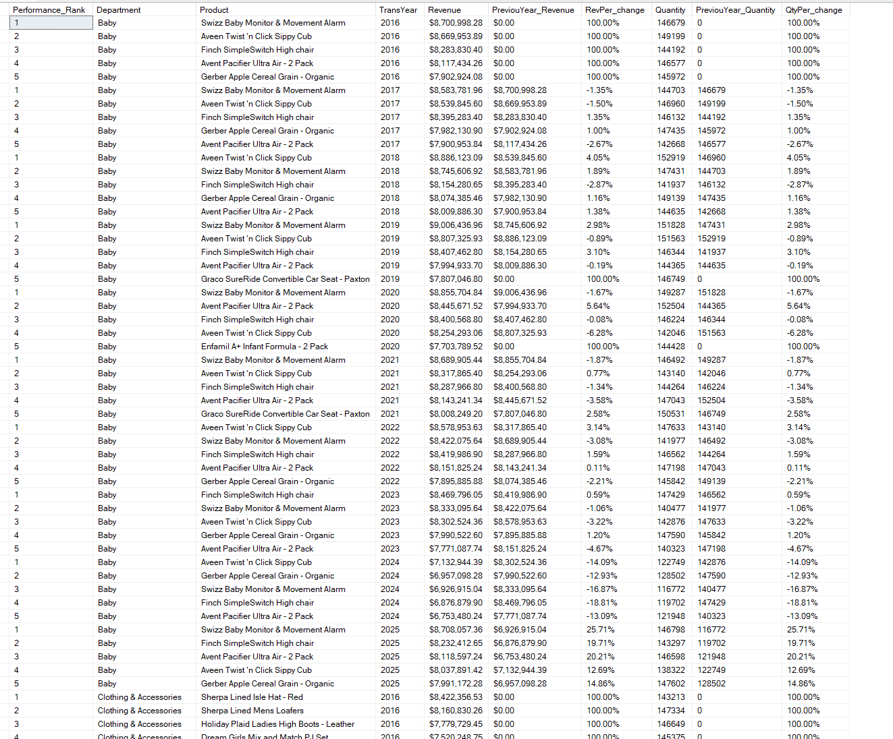

# 📊 Year-over-Year (YOY) Top 5 Product Performance Analysis  
### Using T-SQL Stored Procedure for Dynamic Aggregation and Ranking

---

## 🧭 Introduction
This project demonstrates the design and implementation of a **SQL Server Stored Procedure** to automate **Year-over-Year (YOY)** performance analysis of products within various departments.  
The procedure dynamically identifies the **Top 5 performing products per department per year** and calculates **YOY growth** in both **Revenue** and **Quantity Sold**.

This project highlights strong skills in **SQL engineering, data transformation, and analytical modeling**, relevant to enterprise-scale reporting systems.

---

## 💡 Problem Statement
The analytics team needed an automated way to determine the **Top 5 products** in each department by revenue and quantity for every fiscal year, and to track **YOY performance trends** without manual effort.  

The system must:
- Dynamically calculate **departmental top products**.  
- Compute **YOY percentage changes** for revenue and quantity.  
- Output **clean, formatted results** ready for BI dashboards.  
- Scale efficiently across growing transactional data.

---

## 🧠 Skills Demonstrated
- **T-SQL Stored Procedures** and temporary table management  
- **Common Table Expressions (CTEs)** for modular query design  
- **Window Functions** (`DENSE_RANK`, `LAG`) for advanced analytics  
- **Aggregation & Ranking** logic  
- **Data Formatting** using `FORMAT()` for financial and percentage outputs  
- **Performance Optimization** and efficient ETL structuring  

---

## 🗂️ Data Sourcing
Source tables within the operational database:
- **`SalesTransaction`** – transactional data (product, date, unit price, quantity).  
- **`Product`** – product metadata (product name, department ID).  
- **`Department`** – department and category information.  

---

## 🔄 Data Transformation Logic
1. **Stage the data** by joining `SalesTransaction`, `Product`, and `Department`.  
2. **Aggregate** revenue and quantity by product, department, and year.  
3. **Rank** top 5 products per department per year.  
4. **Compute YOY metrics** using the `LAG()` function.  
5. **Format and store** the results for reporting.

---

## 💻 SQL Stored Procedure

Below is the complete **T-SQL code** used for this project:

```sql
CREATE PROCEDURE YOY_TOP5 AS
BEGIN 

    DROP TABLE IF EXISTS ##Staging_YOY_Top5; 

    -- Mapping all dataset needed into a Temporary Staging table
    SELECT * INTO ##Staging_YOY_Top5 FROM (
        SELECT 
            p.ProductID, 
            Product,
            Department, 
            TransDate,
            UnitPrice, 
            Quantity
        FROM [dbo].[SalesTransaction] s
        INNER JOIN Product p ON p.ProductID = s.ProductID
        INNER JOIN Department d ON d.DepartmentID = p.DepartmentID
    ) aa;

    DROP TABLE IF EXISTS ##YOY_Top5_Analysis;

    /* Cleaning and analysing for top 5 product in each department for each year,
       and computing YOY analysis with percentage change */
    WITH Aggregation AS (
        SELECT 
            Department, 
            Product, 
            YEAR(TransDate) AS TransYear,
            SUM(Quantity * UnitPrice) AS Revenue,
            SUM(Quantity) AS Quantity
        FROM ##Staging_YOY_Top5
        GROUP BY Department, Product, YEAR(TransDate)
    ),
    Ranking AS (
        SELECT 
            DENSE_RANK() OVER (PARTITION BY Department, TransYear ORDER BY Revenue DESC, Quantity DESC) AS Performance_Rank,
            Department, Product, TransYear, Revenue, Quantity
        FROM Aggregation
    ),
    T_five AS (
        SELECT 
            Performance_Rank, 
            Department, Product, TransYear, Revenue,
            ISNULL(LAG(Revenue) OVER (PARTITION BY Department, Product ORDER BY TransYear), 0) AS PreviouYear_Revenue,
            Quantity,
            ISNULL(LAG(Quantity) OVER (PARTITION BY Department, Product ORDER BY TransYear), 0) AS PreviouYear_Quantity
        FROM Ranking
        WHERE Performance_Rank <= 5
    )
    SELECT  
        Performance_Rank,
        Department, 
        Product, 
        TransYear, 
        FORMAT(Revenue, 'c') AS Revenue,
        FORMAT(PreviouYear_Revenue, 'c') AS PreviouYear_Revenue,
        FORMAT(
            CASE WHEN PreviouYear_Revenue = 0 
                 THEN 1 
                 ELSE (Revenue - PreviouYear_Revenue) / PreviouYear_Revenue 
            END, 'p'
        ) AS RevPer_change,
        Quantity,
        PreviouYear_Quantity,
        FORMAT(
            CASE WHEN PreviouYear_Quantity = 0 
                 THEN 1 
                 ELSE (Quantity - PreviouYear_Quantity) / PreviouYear_Quantity 
            END, 'p'
        ) AS QtyPer_change
    INTO ##YOY_Top5_Analysis
    FROM T_five
    ORDER BY Department, TransYear, Performance_Rank;
	 
    DROP TABLE ##Staging_YOY_Top5;

    SELECT * 
    FROM ##YOY_Top5_Analysis
    ORDER BY Department, TransYear, Performance_Rank;

END;
```
 <p align="center">
  
</p>

---

## 🧾 Conclusion
The `YOY_TOP5` procedure provides a **fully automated, dynamic analysis** of product performance across time and departments.  
It eliminates manual reporting bottlenecks and enhances data-driven decision-making by delivering clear visibility into year-over-year trends.

Key benefits:
- Real-time insights on top-performing products.  
- Quick detection of underperforming departments or declining products.  
- Supports both **operational** (transactional) and **analytical** (BI) workloads.  

---

## 🧰 Tools & Technologies
- **Microsoft SQL Server (T-SQL)** — Stored procedure development and data processing  
- **SQL Window Functions** — `DENSE_RANK`, `LAG`, and `FORMAT` for advanced analytics  
- **Common Table Expressions (CTEs)** — Query modularization and readability  
 

---

